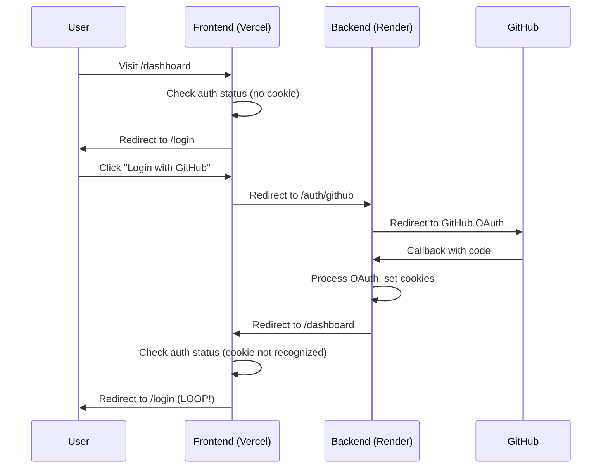
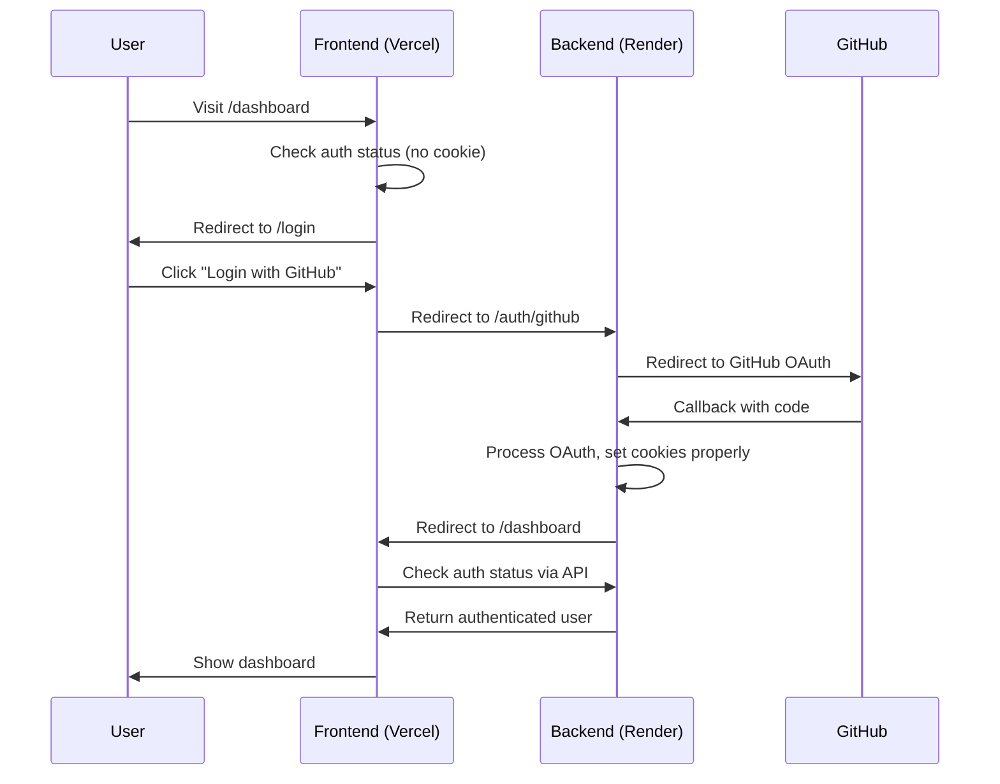

# Design Document

## Overview

The OAuth authentication redirect loop is caused by a combination of cross-domain cookie configuration issues, CORS settings, and frontend authentication state management problems. The application uses a Vercel frontend (https://readivine.vercel.app) communicating with a Render backend (https://readivine.onrender.com), which creates a cross-origin scenario requiring specific cookie and CORS configurations.

### Root Cause Analysis

After analyzing the provided code, I've identified several critical issues:

1. **Cookie Configuration Issues**: The backend sets cookies with `sameSite: 'none'` and `secure: true` in production, but the frontend may not be properly configured to handle these cross-site cookies.

2. **CORS Configuration Gaps**: While CORS is configured to allow credentials, there may be timing issues with preflight requests and cookie handling.

3. **Frontend Authentication Flow**: The frontend's authentication check (`/auth/check`) endpoint has a custom implementation that may not properly handle the authentication state immediately after OAuth redirect.

4. **Environment Variable Inconsistencies**: The frontend uses different backend URLs for OAuth flow vs API calls, which can cause cookie domain mismatches.

## Architecture

### Current Flow (Problematic)


### Fixed Flow (Target)


## Components and Interfaces

### Backend Cookie Configuration
The backend cookie settings need to be optimized for cross-domain scenarios:

```javascript
const cookieOptions = {
  httpOnly: true,
  secure: true, // Always true in production (HTTPS)
  sameSite: 'none', // Required for cross-site cookies
  path: '/',
  maxAge: 7 * 24 * 60 * 60 * 1000, // 7 days
  // No domain restriction for cross-origin
};
```

### CORS Configuration Enhancement
The CORS configuration needs to be more explicit about handling credentials:

```javascript
const corsOptions = {
  origin: function (origin, callback) {
    // Explicit origin checking with proper error handling
  },
  credentials: true,
  methods: ['GET', 'POST', 'PUT', 'DELETE', 'PATCH', 'OPTIONS'],
  allowedHeaders: ['Origin', 'X-Requested-With', 'Content-Type', 'Accept', 'Authorization'],
  exposedHeaders: ['Set-Cookie'],
  optionsSuccessStatus: 200, // For legacy browser support
  preflightContinue: false,
};
```

### Frontend Authentication State Management
The frontend needs enhanced authentication checking with proper error handling:

```javascript
const checkAuthStatus = async () => {
  try {
    // Make explicit API call to verify authentication
    const response = await api.get("/auth/status");
    // Handle response and update state
  } catch (error) {
    // Distinguish between network errors and auth failures
    if (error.response?.status === 401) {
      // Not authenticated - expected behavior
    } else {
      // Network or server error - handle appropriately
    }
  }
};
```

### API Service Configuration
The API service needs consistent URL handling and proper credential configuration:

```javascript
const api = axios.create({
  baseURL: getApiBaseUrl(),
  withCredentials: true,
  timeout: 30000,
  headers: {
    'Content-Type': 'application/json',
  },
});
```

## Data Models

### Authentication State Model
```javascript
{
  isAuthenticated: boolean,
  isLoading: boolean,
  user: {
    _id: string,
    username: string,
    email: string,
    avatarUrl: string,
    githubId: string
  } | null,
  error: string | null,
  hasCheckedAuth: boolean
}
```

### Cookie Data Model
```javascript
{
  accessToken: string, // JWT token
  refreshToken: string, // Refresh token
  // Both stored as httpOnly cookies
}
```

### API Response Model
```javascript
{
  statusCode: number,
  data: {
    authenticated: boolean,
    user: UserModel | null
  },
  message: string,
  success: boolean
}
```

## Error Handling

### Backend Error Handling
1. **OAuth Callback Errors**: Enhanced error logging and user-friendly error pages
2. **Cookie Setting Failures**: Detailed logging of cookie configuration and browser compatibility
3. **CORS Preflight Failures**: Proper handling of OPTIONS requests and origin validation

### Frontend Error Handling
1. **Authentication Check Failures**: Distinguish between network errors and authentication failures
2. **Cookie Access Issues**: Fallback mechanisms when cookies are not accessible
3. **Redirect Loop Prevention**: Circuit breaker pattern to prevent infinite redirects

### Error Recovery Strategies
1. **Retry Mechanisms**: Automatic retry for transient network failures
2. **Fallback Authentication**: Alternative authentication methods if cookies fail
3. **Debug Information**: Comprehensive logging for production debugging

## Testing Strategy

### Backend Testing
1. **Cookie Configuration Tests**: Verify cookie settings in different environments
2. **CORS Integration Tests**: Test cross-origin requests with credentials
3. **OAuth Flow Tests**: End-to-end testing of GitHub OAuth integration
4. **Error Scenario Tests**: Test various failure modes and error handling

### Frontend Testing
1. **Authentication State Tests**: Test authentication state management and transitions
2. **API Integration Tests**: Test API calls with proper credential handling
3. **Routing Tests**: Test protected and public route behavior
4. **Cross-Browser Tests**: Verify cookie handling across different browsers

### Integration Testing
1. **Cross-Domain Tests**: Test full authentication flow between Vercel and Render
2. **Production Environment Tests**: Test in actual deployment environments
3. **Cookie Persistence Tests**: Verify cookies persist across browser sessions
4. **Error Recovery Tests**: Test error handling and recovery mechanisms

## Security Considerations

### Cookie Security
1. **HttpOnly Flags**: Prevent XSS attacks by making cookies inaccessible to JavaScript
2. **Secure Flags**: Ensure cookies are only sent over HTTPS in production
3. **SameSite Configuration**: Proper configuration for cross-site request protection

### CORS Security
1. **Origin Validation**: Strict validation of allowed origins
2. **Credential Handling**: Secure handling of credentials in cross-origin requests
3. **Preflight Security**: Proper handling of preflight requests

### Token Security
1. **JWT Validation**: Proper validation of JWT tokens on each request
2. **Token Expiration**: Appropriate token expiration times
3. **Refresh Token Rotation**: Secure refresh token handling

## Performance Considerations

### Cookie Optimization
1. **Cookie Size**: Minimize cookie size to reduce request overhead
2. **Cookie Expiration**: Appropriate expiration times to balance security and UX
3. **Cookie Compression**: Consider token compression for large payloads

### API Optimization
1. **Request Caching**: Cache authentication status to reduce API calls
2. **Connection Pooling**: Optimize HTTP connections between services
3. **Response Compression**: Enable gzip compression for API responses

### Frontend Optimization
1. **State Management**: Efficient authentication state management
2. **Route Optimization**: Minimize unnecessary redirects and route changes
3. **Loading States**: Proper loading states to improve perceived performance